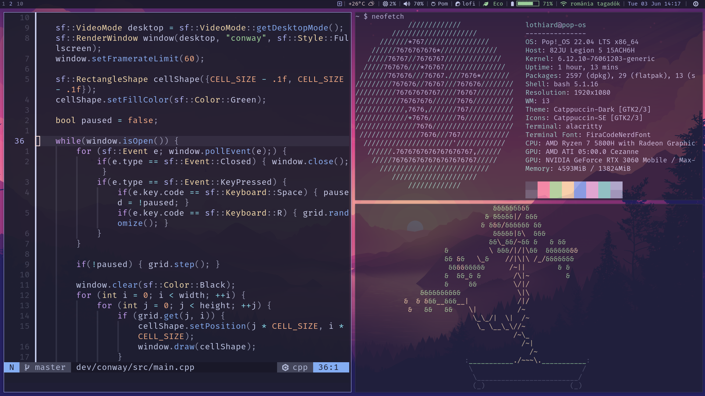

# dotfiles
- The linux rice is mostly shamelessly copied from [Cattendeavour](https://github.com/jifuwater/Cattendeavour) and just slightly adjusted to taste.
- The nvim init.lua is mostly [kickstart.nvim](https://github.com/nvim-lua/kickstart.nvim)

## rice
notable differences from Cattendeavour:
- made it compatible with Pop!_OS
- adjusted i3 keybinds and scripts
- added lofi radio and wifi to i3blocks

### desktop

### bar

## todo
- remove unused files
- rename italian things
